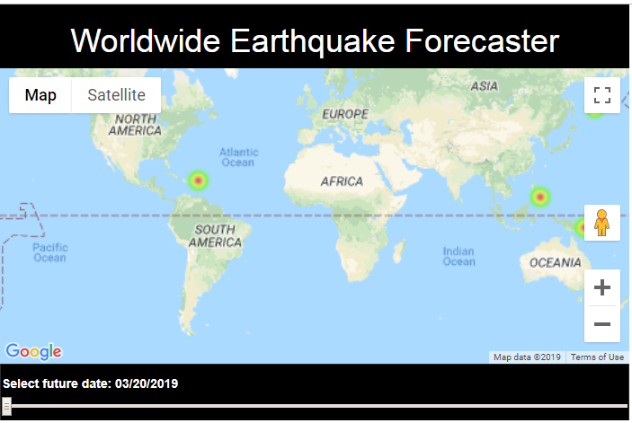

# Predicting Earthquakes with Google Maps

## What's Our Goal?
In our second ML-to-WebApp project, we are going to build an earthquake forecasting tool using live earthquake data from the USGS Earthquake Hazards Program and Google Maps API.

We will start by doing some exploratory data analysis (EDA) on the earthquakes-feed data along with some geo-based and rapid mapping techniques. We will apply feature engineering and aggregation techniques to limit the scope of the web application.

We will then design a model based around the belief of cyclicality around deeper earthquakes by using rolling averages of historical earthquake magnitudes and depths.

Finally, we model the data using the extremely powerful XGBoost optimized distributed gradient boosting library and predict the likelihood of earthquakes at future dates using an HTML slider and Google Maps.

Below are the steps involved in this project

* Get past months earthquake data from earthquake.usgs.gov
* Data Preparation
* Feature Engineering
* Prepare live data
* Set outcome variable
* Model data and check AUC score
* Predict on live data

## Abstracting Code Into Functions For Our Web Appliction

Here we want to package all the above code into a few functions to make thing easier to impolement, run, and debug. The "prepare_earthquake_data_and_model()" function will do everything we did above up to predicting earthquakes on the live data. This is only run when the server is started or restared.

The "get_earth_quake_estimates()" function is called whenever the user moves the slider and will yeild a new set of geo-coordinates with earthquake activity for that day.

## Google Maps

You will need to create a free Google Maps API Key. In this project, we're going to introduce some really cool front-end tools like Ajax, Google Maps, and on-the-fly predictions.

The skeleton will be a little like the pervious project of having one "main.py" web-serving Python file that will prepare data and data model adn will also control web content. We will also have on additional folder called 'template' to hold the web template.

## Worldwide Earthquake Forecaster

A look at our final product:



## Flask Source Code
We wil work with only two files - main.py and index.html. Create the following folder structure:

```
earthquake-forecaster/ 
├── main.py 
└── templates/ 
    └── index.html
```

## PythonAnywhere
You will need to use bash/console to install below Python library on PythonAnywhere:

pip3 install scikit-learn --user
