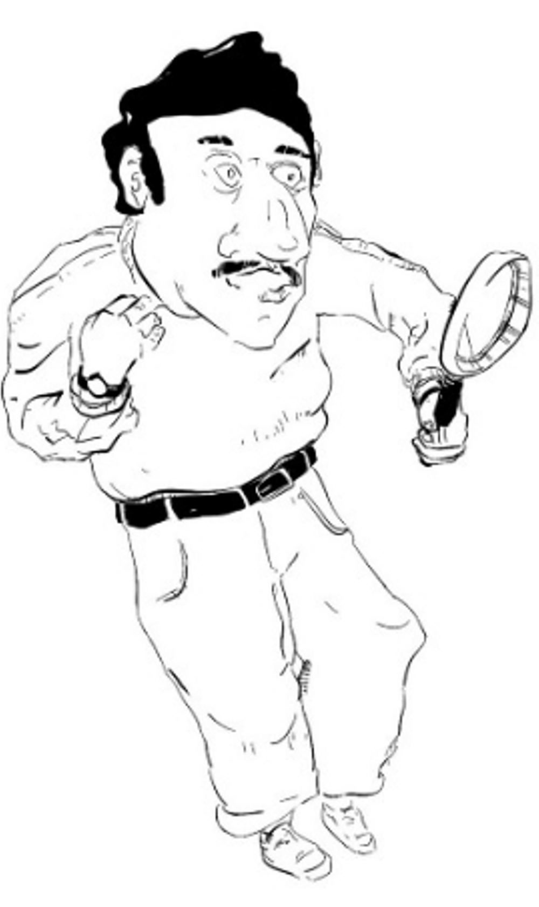

# Creating the Plagiarism Defender

## What's Our Goal?
In our first ML-to-WebApp project, we are going to explore a product idea, code it in Jupyter, then code it into a local Flask application, and finally export it to the web on PythonAnywhere.

The idea is to create an application that can ingest writing samples and tell us if they are original or plagiarized. This app takes text as input, splits it into sentences using Natural Language Toolkit (NLTK), and sends it to the Bing search engine for matches.

It surrounds each sentence with quotes to only find exact matches. If a match is found, then that sentence is deemed plagiarized and the counter is incremented. It does so for all sentences and returns the mean counter value as a plagiarism score.

## Coding Our Plagiarism Detecting in Python
Even though this first project is relatively simple, the steps involved should be the same for more complex projects - take you time, have fun, when in doubt start again, and, most importantly, always think about the possibilities for your own ideas!

```python
import requests, time
# sudo pip3 install -U nltk
from nltk.tokenize.punkt import PunktSentenceTokenizer, PunktParameters 
import urllib
from urllib.parse import quote 
# Try it out on the first lines of Moby Dick:
text_to_check = "Call me Ishmael. Some years ago - never mind how long precisely - having little or no money in my purse, and nothing particular to interest me on shore"
# text_to_check = "this is my super secret and custom original data"

punkt_param = PunktParameters()
sentence_splitter = PunktSentenceTokenizer(punkt_param)
sentences = sentence_splitter.tokenize(text_to_check)
probability_of_plagiarism = 0

for a_sentence in sentences:
    print(a_sentence)
    time.sleep(0.3)
    the_term = urllib.parse.quote('+' + '"' + a_sentence + '"')
    page = requests.get('https://www.bing.com/search?q='+the_term)
    # make sure you are using the correct language depending on the country you are in.
    # you can check by entering in the Bing search box: +'hello+1234+wont+find'
    # for a Spanish country, replace with "No hay resultados para"
    if (not "There are no results for" in page.text) and (not "No hay resultados para" in page.text):
        probability_of_plagiarism += 1;

print('Probability of plagiarism: ' + str((probability_of_plagiarism / len(sentences)) * 100) + '%')
```
`this is my super secret and custom original data`<br>
`Probability of plagiarism: 0.0%`

Yes, it works! The Python code for our first web application is working and can successfully detect plagiarized content.

This may not scale well as Bing would probably get upset with excessive automated calls, but will do fine for this demonstration. Let’s push this out onto the web and get some exposure.

The next step to create a web application is to build a local Flask application. This will allow us to test design concepts such as the process flow of the application, user interface elements, wording, and iron out any bugs locally before moving to an external provider.

## Local Flask Application

**Start a Project Directory** 

Create a new folder named "Plagiarism_Defender", open a command/terminal window and navigate to it. 

**Start a Virtual Environment** 

As always, it is a good idea to work in a virtual environment, so get one going and pip3 install the required Python libraries. 

```python
python3 −m venv plagiarismdefender  
source plagiarism_defender
/bin/activate  
pip3 install Flask # or: python3 -m pip install Flask  
pip3 install -U nltk # or: python3 -m pip install -U nltk  
pip3 install lxml # or: python3 -m pip install lxml 
pip3 install requests # or: python3 -m pip install requests 
``` 
**Create Main Web-Serving Python File** 

Open your text/code interpreter and create a new Python file called "main.py" in the working directory. This will be the brains behind our web-serving operation and where we point the WSGI (the Web Server Gateway Interface (WSGI) server is the interface that will run our Python web application).

```python
from flask import Flask, render_template, request, url_for
import urllib 
from urllib.parse import quote 
from lxml import html 
import requests 
import string 
import time 
from nltk.tokenize.punkt import PunktSentenceTokenizer, PunktParameters; 

# Initialize the Flask application 
app = Flask(__name__) 

# Define a route for the default URL, which loads the form 
@app.route('/') 

def form(): 
  return render_template('plagiarizer-submit.html') 
  
@app.route('/IsItPlagiarized/', methods=['POST']) 

def IsItPlagiarized(): 
  text_to_filter=request.form['text_to_check'] 
  if (text_to_filter.lstrip().rstrip() == ''): 
    return render_template('plagiarizer-submit.html') 
  punkt_param = PunktParameters()
  sentence_splitter = PunktSentenceTokenizer(punkt_param)
  sentences = sentence_splitter.tokenize(text_to_filter) 
  probability_of_plagiarism = 0 
  for a_sentence in sentences:
    time.sleep(0.3)
    content = filter(lambda x: x in string.printable, a_sentence)
    the_term = urllib.parse.quote('+' + '"' + str(content) + '"')
    page = requests.get('https://www.bing.com/search?q='+the_term) 

    if ((not "No results found for" in page.text) and (not "No hay resultados para" in page.text)): 
      probability_of_plagiarism += 1
  
  is_it_plagiarized = str((probability_of_plagiarism / len(sentences)) * 100) + '%' 
  return render_template('plagiarizer-results.html', text_to_filter=text_to_filter, is_it_plagiarized=is_it_plagiarized) 

  
if __name__ == "__main__": 
  app.run(debug=True)
```

**Template Files** 

Our "main.py" file generates dynamic data which is sends to template files. Template files are simply HTML files holding files which can display both static content and dynamic content generated by Python. Create a new folder called "templates" under our working directory. Then create a new file called "plagiarizer-submit.html" 

```html
<html>
  <head>
    <title>Plagiarism Defender</title>
    <link rel="stylesheet" href="https://stackpath.bootstrapcdn.com/bootstrap/4.1.3/css/bootstrap.min.css" integrity="sha384-MCw98/SFnGE8fJT3GXwEOngsV7Zt27NXFoaoApmYm81iuXoPkFOJwJ8ERdknLPMO" crossorigin="anonymous">

  </head>
  <body style = "background-color: black; padding-top: 10px; ">
    <nav class="navbar navbar-inverse navbar-fixed-top">
      <div class="container">
        <div class="navbar-header">
            <H1><font color="white" style="color:white">Plagiarism Defender</font></H1>
        </div>
      </div>
    </nav>

    <div class="container">
        <table cellpadding="10" cellspacing="10" border = '0' bgcolor="white"  style="background-color:white">
        <tr>
          <td>
            
          </td>
          <td>
             <div class="container">
              <form method="post" action="{{ url_for('IsItPlagiarized') }}">
                <label for="text_to_check">Enter text to check for plagiarism:</label>
                <BR><textarea cols="40" rows="20" name="text_to_check"></textarea>
                <BR><input type="submit" />
              </form>
            </div>
          </td>
        </tr>
        </table>
    </div>

  </body>
</html>
```

Create a second file called "plagiarizer-results.html"

```html
<html>
    <head>
        <title>Plagiarism Defender</title>
        <link rel="stylesheet" href="https://stackpath.bootstrapcdn.com/bootstrap/4.1.3/css/bootstrap.min.css" integrity="sha384-MCw98/SFnGE8fJT3GXwEOngsV7Zt27NXFoaoApmYm81iuXoPkFOJwJ8ERdknLPMO" crossorigin="anonymous">
    </head>
      <body style = "background-color: black; padding-top: 10px; ">
        <nav class="navbar navbar-inverse navbar-fixed-top">
          <div class="container">
            <div class="navbar-header">
                <H1><font color="white" style="color:white">Plagiarism Defender</font></H1>
            </div>
          </div>
        </nav>

        <div class="container">
            <table cellpadding="10" cellspacing="10" bgcolor="white"  style="background-color:white">
            <tr>
              <td>
                In our best opinion, the text you entered is <strong>{{is_it_plagiarized}}</strong> plagiarized!
             </td>
            </tr>
            <tr>
             <td>
                Text Entered: <br><br><strong>{{text_to_filter}}</strong>
             </td>
            </tr>
        </div>
    </body>
</html>
```
**Running the Local Flask Plagiarism Defender Application** 

It's time to take our web application for a spin. Make sure you are right under the working directory and not the "templates" one. Just like we did with our previous introductory Flask example, enter the following command in your command/terminal window: 

```python 
$ python3 main.py 
``` 
It works! We have created a web application that accepts user input and checks if it is plagiarized. One of the most important tenets of this ML Entrepreneurship class is to create tools where any user can successfully interact with complex tools in an effortless manner. The big difference in using the web version of this tool over the Jupyter notebook one is that it is easy and much more intuitive to use. A web application with a simple design will allow anybody, even those without programming experience to benefit from even highly complex ideas as we'll see later.

## Beautifying Our Web Application with Bootstrap

Let's be honest here, what the application makes up in simplicity, sure lacks in beauty. No worries, with very little work, we can make this look 10x better by simply invoking Bootstrap. By just adding a few lines of code, you can magically give you site a professional look!

GetBootstrap.com has a big menu where you can pick and choose how you want your site to look. We’re going to go with the Starter template, it is simple but a whole lot better than what we currently have. You can click on any sample shown, do a view source and pick whatever part of the code you like.

Lets update our plagiarizer-submit.html page with a few bootstrap goodies. Replace the "plagiarizer-submit.html" script with the following code:

```html
<html>
  <head>
    <title>Plagiarism Defender</title>
    <link rel="stylesheet" href="https://stackpath.bootstrapcdn.com/bootstrap/4.1.3/css/bootstrap.min.css" integrity="sha384-MCw98/SFnGE8fJT3GXwEOngsV7Zt27NXFoaoApmYm81iuXoPkFOJwJ8ERdknLPMO" crossorigin="anonymous">

  </head>
  <body style = "background-color: black; padding-top: 10px; ">
    <nav class="navbar navbar-inverse navbar-fixed-top">
      <div class="container">
        <div class="navbar-header">
            <H1><font color="white" style="color:white">Plagiarism Defender</font></H1>
        </div>
      </div>
    </nav>

    <div class="container">
        <table cellpadding="10" cellspacing="10" border = '0' bgcolor="white"  style="background-color:white">
        <tr>
          <td>
            
          </td>
          <td>
             <div class="container">
              <form method="post" action="{{ url_for('IsItPlagiarized') }}">
                <label for="text_to_check">Enter text to check for plagiarism:</label>
                <BR><textarea cols="40" rows="20" name="text_to_check"></textarea>
                <BR><input type="submit" />
              </form>
            </div>
          </td>
        </tr>
        </table>
    </div>

  </body>
</html>
```
Wow! We linked one Bootstrap CSS script and added a few "div" tags and suddenly things are looking up - way up! The most important change is on the fourth line where we added a live link to the bootstrap CSS file. We also added the navbar class which adds a fancy title on a header, a couple of "div" tags pointing to the "container" class, and setting the background color. Explore GetBootstrap.com to see what else it offers and how you may apply it to your projects - a great use of your time if you're looking for easy ways to get that professional look.

## Let's Beautify the with Bootstrap

Let's apply the same techinque to the "plagiarizer-results.html" page. Replace the old script with the following code:
```html
<html>
    <head>
        <title>Plagiarism Defender</title>
        <link rel="stylesheet" href="https://stackpath.bootstrapcdn.com/bootstrap/4.1.3/css/bootstrap.min.css" integrity="sha384-MCw98/SFnGE8fJT3GXwEOngsV7Zt27NXFoaoApmYm81iuXoPkFOJwJ8ERdknLPMO" crossorigin="anonymous">
    </head>
      <body style = "background-color: black; padding-top: 10px; ">
        <nav class="navbar navbar-inverse navbar-fixed-top">
          <div class="container">
            <div class="navbar-header">
                <H1><font color="white" style="color:white">Plagiarism Defender</font></H1>
            </div>
          </div>
        </nav>

        <div class="container">
            <table cellpadding="10" cellspacing="10" bgcolor="white"  style="background-color:white">
            <tr>
              <td>
                In our best opinion, the text you entered is <strong>{{is_it_plagiarized}}</strong> plagiarized!
             </td>
            </tr>
            <tr>
             <td>
                Text Entered: <br><br><strong>{{text_to_filter}}</strong>
             </td>
            </tr>
        </div>
    </body>
</html>
```

## Closing Down the Virtual Environment

To stop the web application from serving the 'Hello World!' page, hit 'ctrl-c' in your terminal window. Finally, to turn terminate your virtual environment run the following command:

`$ deactivate simple_flask`

## Plagiarism Defender on PythonAnywhere

It's time to deploy our web appliction on to PythonAnywhere.com.

Log into your instance of PythonAnywhere and create a new directory called "plagiarism_defender" and a new file called "main.py" and copy the code we used for our local Flask application (or upload the file we worked on earlier).

Create a directory called "templates" and an HTML file called "plagiarizer-submit.html" and copy the code we used for our local Flask application. Do the same for file "plagiarizer-results.html". Your folder directory should look like:

```
plagiarism-defender/
├── main.py
├── static/
    └── images
        └── plagiarism-checker.png
└── templates/
    ├── plagiarizer-submit.html
    └── plagiarizer-results.html
```

Go to the the "Web" tab and point the source code to your PlagiarismDefender folder and update the Web Server Gateway Interface (WSGI) configuration file so it has the correct "project_home" path and import statement.

```python
# This file contains the WSGI configuration required to serve up your
# web application at http://<your-username>.pythonanywhere.com/
# It works by setting the variable 'application' to a WSGI handler of some
# description.
#
# The below has been auto-generated for your Flask project

import sys

# add your project directory to the sys.path
project_home = u'/home/amunateguioutlook/plagiarism_defender'
if project_home not in sys.path:
    sys.path = [project_home] + sys.path

# import flask app but need to call it "application" for WSGI to work
from main import app as application
```
Finally, click the big green "Reload..." button and your new web appliction is live!!
